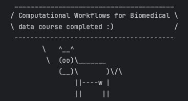

# Comp_Workflows_WERONIKA_JASKOWIAK
Task submission for the course Computational Workflows for Biomedical Data. 

The directory naming scheme was created based on the .ipynb files provided by the tutors.

